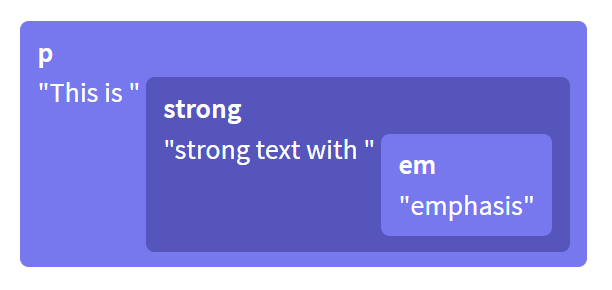
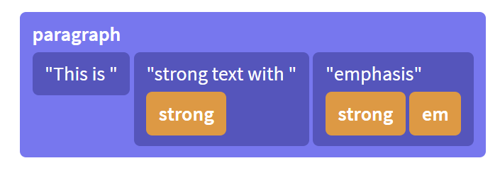

> - 本文档翻译自 ProseMirror 官方网站，版权属于 ProseMirror 官网。
> - 网上有其他网友的翻译，但翻译的较早，恐怕有些内容已经更新了，所以我这里又翻译了一次。
> - 并不是逐字逐句的翻译，里面有我的理解。

# ProseMirror 指南

本指南描述了 ProseMirror 库中使用的各种概念以及它们之间的关系。

为了获得一个完整的印象，建议按照顺序阅读本文档，至少按顺序阅读到`视图组件`小节。

# 简介

ProseMirror 提供了一组用于构建富文本编辑器的工具和概念，用于构建“所见即所得”的文本编辑器，这种编辑器与市面上常见的`样式设置型`编辑器不同。

**ProseMirror 的主要目的是让您的代码可以完全控制文档及文档相关的行为。这里说的文档不是 HTML 文档，而是一个自定义数据结构，它只包含您指定它包含的元素及元素之间的关系。** 所有对文档的更新都经过一个点，在那里你可以检查并处理它们。

核心库不是一个容易使用的组件，**我们将模块化和可定制性的优先级设置的比易用性的优先级高。** 基于此，人们将分发基于 ProseMirror 构建自己的编辑器。因此，ProseMirror 更像是一套乐高积木，而不是火柴盒汽车。

ProseMirror 有 4 个核心模块，做任何编辑工作都需要这 4 个模块，ProseMirror 还有很多扩展模块提供一些挺有用的功能，这些模块也是由官方团队维护的。但这些模块却不是必须的。

核心模块是：

- prosemror-model 定义编辑器的文档数据模型，用于描述用户所编辑的内容的数据结构。
- prosemror-state 用于描述编辑器内数据结构的数据状态，包括选中状态、以及从一个状态移动到下一个状态的事务系统。
- prosemror-view 是一个用户界面组件，该组件将给定的数据状态显示在浏览器中的的一个可编辑元素内，并处理与该元素的用户交互。
- prosemror-transform 模块用于记录和重放用户对文档的修改，这是状态模块（prosemror-state）中事务的基础，并使**撤销操作和协作编辑**成为可能。

此外，在 GitHub ProseMirror 组织下，还有 basic editing commands, binding keys, undo history, input macros, collaborative editing, a simple document schema 等模块。

ProseMirror 不提供浏览器直接可用的脚本，这意味着在使用它时，你可能需要使用某种捆绑器，这样才能把你的脚本与 ProseMirror 的脚本捆扎在一起（顺便也就完成了 tree shaking 的工作）。

## 第一个编辑器

你可以用下面的代码创建一个非常简单的编辑器：

```js
import { schema } from "prosemirror-schema-basic";
import { EditorState } from "prosemirror-state";
import { EditorView } from "prosemirror-view";

let state = EditorState.create({ schema });
let view = new EditorView(document.body, { state });
```

ProseMirror 要求您指定文档遵循的模式，因此它所做的第一件事是导入一个包含基本模式的模块。

接着 ProseMirror 会使用这个基本模式模块创建数据状态，该状态将生成符合该模式的空文档，默认的输入位置（选中区域）被设置到该文档开始处。

最后，为状态创建一个视图，并将其附加到 document.body。

这将把状态文档呈现为可编辑的 DOM 节点，并在用户输入时生成状态事务。

这个编辑器还不是很好用。例如，如果按下 Enter 键，什么也不会发生，因为我们并没有告诉和核心库该如何处理 Enter 键。我们马上就会讲到这个。

## 事务 Transactions

当用户输入数据或与视图交互时，它会生成“状态事务”。这意味着它不只是就地修改文档并隐式更新数据状态。相反，每一次更改都会创建一个更改事务，该事务描述对状态所做的更改，并可用于创建一个新状态，然后使用该状态更新视图。

默认情况下，这一切都发生在幕后，但你可以通过编写插件或配置视图钩子来获得这些数据状态。

```js
// (Imports omitted)

let state = EditorState.create({ schema });
let view = new EditorView(document.body, {
  state,
  dispatchTransaction(transaction) {
    console.log(
      "Document size went from",
      transaction.before.content.size,
      "to",
      transaction.doc.content.size
    );
    let newState = view.state.apply(transaction);
    view.updateState(newState);
  },
});
```

每个状态更新都必须经过 `updateState`，而每个正常的编辑更新都将分派一个事务`dispatchTransaction`。

## 插件 Plugins

插件用于扩展编辑器的行为和数据状态，有些插件比较简单，比如 keymap 插件, 它用来绑定键盘输入操作。还有些插件相对复杂, 比如 history 插件, 它通过监视 transactions 和按照相反的顺序存储它们，以便用户完成 undo/redo 的功能。

让我们将这两个插件添加到编辑器中，以获得撤销/重做功能:

```js
// (Omitted repeated imports)
import { undo, redo, history } from "prosemirror-history";
import { keymap } from "prosemirror-keymap";

let state = EditorState.create({
  schema,
  plugins: [history(), keymap({ "Mod-z": undo, "Mod-y": redo })],
});
let view = new EditorView(document.body, { state });
```

我们在创建数据状态的时候注册插件(因为它们需要访问数据状态对象的 transactions 的权限). 现在你可以通过按 Ctrl+Z( Mac 下 Comand+Z) 撤销上一步操作。

## 命令 Commands

前面示例中绑定到键的 undo 和 redo 值是一种称为 commands 的特殊函数。大多数编辑操作都以命令的形式编写，可以绑定到按键或者菜单上，或以其他方式向用户公开。

prosemror-commands 包提供了许多基本的编辑命令，以及一些必要的按键行为，以便在编辑器中正确执行 Enter 键和 Delete 键的按键操作。

```js
// (Omitted repeated imports)
import { baseKeymap } from "prosemirror-commands";

let state = EditorState.create({
  schema,
  plugins: [
    history(),
    keymap({ "Mod-z": undo, "Mod-y": redo }),
    keymap(baseKeymap),
  ],
});
let view = new EditorView(document.body, { state });
```

至此，您完成了一个有基础功能的编辑器。

如果还想增加一个菜单，或者想增加一些按键绑定, 那么你应该看下 prosemirror-example-setup 这个包。这个包为您提供了一组设置基本编辑器的插件，但它更像是一个示例，而不是一个生产级库。如果要用于生产的话，你可能要写一些自己的代码来替换这个包里的部分内容。

## 内容 Content

一个数据状态对象 `state` 的 `doc` 属性的值就是文档对象`document`。文档对象是一个只读数据结构，有点像浏览器的 DOM，以树状层级结构描述文档信息。举个例子：一个简单的文档对象可能是一个`doc`节点包含两个`paragraph`节点，每个`paragraph`节点分别包含一个`text`节点。

在初始化一个数据状态对象`state`时，您可以给它一个初始文档对象。在这种情况下，schema 字段是可选的，因为 schema 可以从文档中获取。（`EditorState.create`方法）

接下来我们把一个 HTML 的 Dom 结构格式化为一个文档对象，然后用这个文档对象初始化数据状态对象 state，下面代码使用 DOM parser 把 HTML 的 Dom 对象序列化成 ProseMirror 的文档对象（schema 信息不用再提供了，可以从文档对象中得到）。

```js
import { DOMParser } from "prosemirror-model";
import { EditorState } from "prosemirror-state";
import { schema } from "prosemirror-schema-basic";

let content = document.getElementById("content");
let state = EditorState.create({
  doc: DOMParser.fromSchema(schema).parse(content),
});
```

# 文档

ProseMirror 定义了自己的数据结构来表示文档内容。由于整个编辑器都是围绕文档构建的，所以了解文档的数据结构及工作原理是非常有价值的。

## 数据结构 Structure

一个 ProseMirror 的文档对象可以包含 0 个或多个子节点，这与 Html 的 Dom 对象非常相似，也是层级树状的。它与 Html 不同之处是：存储内联内容方式（inline content）。

比如下面这段 HTML 代码

```html
<p>
  This is <strong>strong text with <em>emphasis</em></strong>
</p>
```

它的数据表现形式为：



在 ProseMirror 中，这些数据被被扁平的放在一个数据结构中，使用元数据来描述数据的形式：



这更接近于我们思考和处理这类文本的方式。它允许我们使用字符偏移量而不是树中的路径来表示段落中的位置，这样就更容易完成拆分或更改样式等操作，而无需执行笨拙的树操作。

这也意味着每个文档都有一个有效表示。具有相同标记集的相邻文本节点总是组合在一起，不允许空文本节点出现。schema 会决定标记出现的顺序。

所以 ProseMirror 文档对象的大部分叶子节点都是文本节点，而且叶子节点可能包含多个拥有不同样式的文本。您还可以有纯空的叶子节点，用于放置水平线或视频元素。

节点对象具有许多属性，这些属性反映了它们在文档中所扮演的角色:

- isBlock 和 isInline 告诉你给定的节点是块节点还是内联节点。
- inlineContent 值为 true 时，当前节点的子节点都是内联节点。
- isTextblock 为 true 时，当前块节点的子节点都是内联节点。
- isLeaf 标记着当前节点是否为叶子节点，叶子节点不允许再拥有子节点。

因此，一般`paragraph`节点将是一个文本块，而 `blockquote` 可能是一个块节点（可能会包含其他块节点），文本、换行符和内联图像都是内联叶子节点，水平线节点是一个块状叶子节点。
