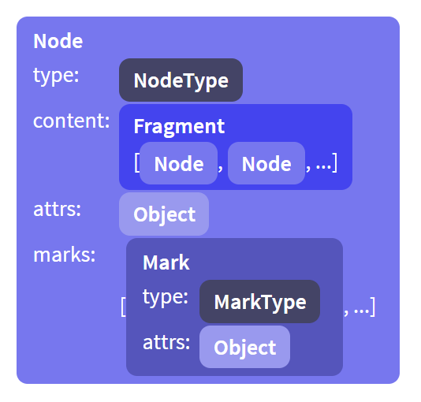

# 文档

ProseMirror 定义了自己的数据结构来表示文档内容。由于整个编辑器都是围绕文档构建的，所以了解文档的数据结构及工作原理是非常有价值的。

## 数据结构 Structure

一个 ProseMirror 的文档对象可以包含 0 个或多个子节点，这与 Html 的 Dom 对象非常相似，也是层级树状的。它与 Html 不同之处是：存储内联内容方式（inline content）。

比如下面这段 HTML 代码

```html
<p>
  This is <strong>strong text with <em>emphasis</em></strong>
</p>
```

它的数据表现形式为：


在 ProseMirror 中，这些数据被被扁平的放在一个数据结构中，使用元数据来描述数据的形式：


这更接近于我们思考和处理这类文本的方式。它允许我们使用字符偏移量而不是树中的路径来表示段落中的位置，这样就更容易完成拆分或更改样式等操作，而无需执行笨拙的树操作。

这也意味着每个文档都有一个有效表示。具有相同标记集的相邻文本节点总是组合在一起，不允许空文本节点出现。schema 会决定标记出现的顺序。

所以 ProseMirror 文档对象的大部分叶子节点都是文本节点，而且叶子节点可能包含多个拥有不同样式的文本。您还可以有纯空的叶子节点，用于放置水平线或视频元素。

节点对象具有许多属性，这些属性反映了它们在文档中所扮演的角色:

- isBlock 和 isInline 告诉你给定的节点是块节点还是内联节点。
- inlineContent 值为 true 时，当前节点的子节点都是内联节点。
- isTextblock 为 true 时，当前块节点的子节点都是内联节点。
- isLeaf 标记着当前节点是否为叶子节点，叶子节点不允许再拥有子节点。

因此，一般`paragraph`节点将是一个文本块，而 `blockquote` 可能是一个块节点（可能会包含其他块节点），文本、换行符和内联图像都是内联叶子节点，水平线节点是一个块状叶子节点。

开发者可以使用 scheme 来为文档对象指定更精确的约束。比如虽然块节点可以作为叶子节点，但并不是所有的块节点都可以作为叶子节点。

## ID 与持久化 Identity and persistence

HTML DOM 对象和 ProseMirror 文档对象之间的另一个重要区别是表示节点行为的方式。在 DOM 中，节点是具有 ID 的可变对象，这意味着一个节点只能出现在一个父节点中，并且是可以被改变的。

在 ProseMirror 文档对象中，节点只是值，就像数字 3 。3 可以同时出现在多个数据结构中，它没有到父节点的链接，如果向它添加 1，则得到一个**新值** 4，而**不改变**原始 3 的任何内容。

ProseMirror 文档对象也是如此。它们不会改变，但可以用作起始值以计算出一个新的文档片段。它们不知道自己是什么数据结构的一部分，他们可以隶属于多个数据结构，甚至可以在一个结构中出现多次。**它们是值，而不是有状态对象**。

这意味着每次更新文档时，都会得到一个新的文档。该文档将共享所有未随原始文档更改的子节点，这使得创建文档的成本相对较低。

这有很多好处。它使编辑器在更新期间不可能处于无效的中间状态，因为新数据会被立即更新到新文档中。这样对文档进行处理的工作就会变得更容易，而且有助于实现协同编辑，并允许 ProseMirror 通过 Diff 算法非常高效的更新 DOM。

ProseMirror 文档的数据结构由常规 JavaScript 对象表示，因为它们几乎总是在多个数据结构之间共享。所以 ProseMirror 不允许开发者修改这些数据，注意，这也适用于作为节点对象一部分的数组属性和普通对象属性，例如用于存储节点属性的对象，或者片段中的子节点数组。

## 数据结构

文档对象的数据结构是这样的：



每个节点是 Node 类的一个实例。type 属性标记着这个节点的类型，通过节点类型可以知道节点的名称、有效的属性等信息。 Node types(和 mark types) 只会被每个 schema 创建一次, 它们知道自己是属于哪个 schema。

节点的 content 属性指向一个 Fragment 类型的实例, 它的内容是一个 nodes 数组. 即使那些没有 content 或者不允许有 content 的 nodes 也是如此（使用共享的 empty fragment）。

节点的 attrs 属性用于存储节点的属性信息 例如, 一个图像节点可能使用 attr 属性存储 alt 文本信息和 src 信息。

节点的 marks 属性用于标记内联节点拥有的信息，例如`emphasis`或`a`，属性的值是一个 Mark 类型的数组。

整个文档对象就是一个节点实例. 文档对象的 content 属性持有该文档的子节点对象，一般情况下，这些文档对象的子节点是一系列的`块节点`, 这些 block nodes 中可能包含 textblocks, 这些 textblocks 可能包含 inline content. 不过, 顶级 node 也可以只是一个 textblock, 这样的话整个 document 就只包含 inline content。

schema 决定哪些节点可以出现在哪些位置是。 以下代码是使用 schema 创建节点的示例代码。

```js
import { schema } from "prosemirror-schema-basic";

// (如果有必要的话，你可以把null替换成你想要的属性)
let doc = schema.node("doc", null, [
  schema.node("paragraph", null, [schema.text("One.")]),
  schema.node("horizontal_rule"),
  schema.node("paragraph", null, [schema.text("Two!")]),
]);
```

## 索引 Indexing

ProseMirror 的节点对象支持两种类型的索引：可以将它们视为树状结构；或者可以将它们视为扁平的序列，使用到节点的偏移量进行索引。

第一种方法允许您执行与 Dom 类似的操作来进行节点交互，使用 child 方法和 childCount 访问子节点，使用递归函数遍历节点(如果你只是想查看所有节点，请使用 descendants 或 nodesBetween 方法)。

第二种方法在定位文档特定位置的内容时更有用。开发者可以使用整数数字来表示文档中的任何位置的内容，实际上这个整数数字这就是扁平序列中的索引。由于每个节点都知道自身的大小，所以用这种方法访问节点成本非常低。

- 文档的开始，在第一个内容的正前方，位置为 0。
- 进入或离开节点(非叶子节点)算作一个标记。因此，如果文档以一个段落开头(标签是 p)，该段落的开头作为位置 1(即 <p> 之后的位置)。
- 文本节点中的每个字符都算作一个标记。因此，如果文档开头的段落包含单词“hi”，位置 2 在“h”之后，位置 3 在“i”之后，位置 4 在整个段落之后。
- 非内容的叶节点(如图像)算作单个标记。

如果你有一个文档，当它被表示为 HTML 时，如果是这样的:

```html
<p>One</p>
<blockquote>
  <p>Two</p>
</blockquote>
```

那么索引的情况如下所示：

```
0   1 2 3 4    5
 <p> O n e </p>

5            6   7 8 9 10    11   12            13
 <blockquote> <p> T w o  </p> </blockquote>
```

每个节点都有一个 nodeSize 属性，该属性为您提供整个节点的大小，您可以访问`.content.size` 获取节点内容的大小。注意，开始<div>和闭合</div>标记不被视为文档的一部分(因为不能将光标放在文档之外)，因此文档的大小为`doc.content.size`,而不是 `doc.nodeSize`

手动计算这些位置需要大量的计数。您可以调用`Node.resolve`以获得一个描述位置的对象。这个对象会告诉你父节点是什么，它到父节点的偏移量是多少，父节点有哪些祖先节点，以及其他一些东西。

请注意区分子索引、文档范围位置`document-wide positions`和节点偏移量之间的区别。

## 切片 Slices

要处理复制粘贴和拖放之类的需求，就必须聊一聊文档切片的知识，也就是两个位置之间的内容。这样的切片不同于完整的节点或片段，因为在它的开始或结束的一些节点可能是“开放的”。slice 与一个完整的 node 或者 fragment 不同，slice 可能是一个未关闭的文档片段，比如`<p>abc<div>123`。
